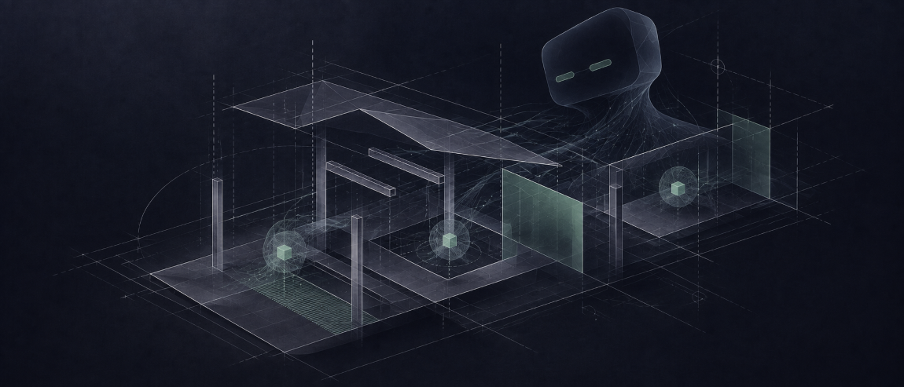
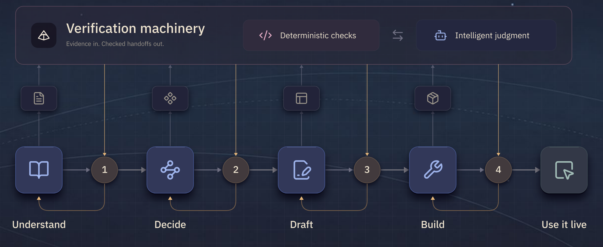

<p align="center">
  
</p>


# Technical Cofounder

<h6></h6>

For solo builders and the build-curious.

**your new AI senior dev team - give them your idea, build it together.**

<h6></h6>
<h6></h6>


<p align="center">
  <a href="#get-started">Get started</a> · 
  <a href="#meet-the-team">Meet the team</a> · 
  <a href="#whats-inside">What’s inside</a> · 
  <a href="#built-together">Built together</a> · 
  <a href="#roadmap">Roadmap</a>
</p>

<h6></h6>

<p align="center">
  <a href="https://claude.com/claude-code"></a>
  <a href="LICENSE"></a>
  <a href="https://github.com/Nova-Caelum/technical-cofounder/actions/workflows/ci.yml"></a>
  
  <a href="https://novacaelum.substack.com/"></a>
</p>

<h6></h6>
<h6></h6>


> "The original version of Technical Cofounder was the first thing I built with agents. The tool has evolved alongside myself and my capabilities with each new build. It has put new things within reach, which is the core mission of Nova Caelum."
>
> *Founder and Principal*
<br>


## Get started

<h6></h6>

### Already know your way around?

Run these from a dedicated project folder. The team installs for that project only, and Hyperspace Engine installs with it.

<h6></h6>

```bash
claude plugin marketplace add https://github.com/Nova-Caelum/plugins.git
claude plugin install technical-cofounder@nova-caelum --scope project
```
<h6></h6>


Start a new session in that folder and say "set up hyperspace" to build the task graph and open its console in your browser.
<h6></h6>

<p align="center">
  <a href="plugins/technical-cofounder-setup/reference/dependencies.md"></a>
  <a href="plugins/technical-cofounder-setup/reference/dependencies.md"></a>
  <a href="plugins/technical-cofounder-setup/reference/dependencies.md"></a>
  <a href="plugins/technical-cofounder-setup/reference/dependencies.md"></a>
  <a href="plugins/technical-cofounder-setup/reference/dependencies.md"></a>
</p>

<p align="center">
  You need Claude Code and Git. Hyperspace Engine needs Python 3.11 or newer, or <a href="https://docs.astral.sh/uv/"><code>uv</code></a>; the message below installs one for you. What each tool is for is written down in <a href="plugins/technical-cofounder-setup/reference/dependencies.md">dependencies.md</a>.
</p>
<h6></h6>

Want the research extras too? `super-novacaelum` adds current documentation lookup, web research and a cloud browser, each on your own account:
<h6></h6>

```bash
claude plugin install super-novacaelum@nova-caelum --scope project
```
<h6></h6>
<h6></h6>


### New to building with agents?

You don't need to type a single command, create a folder or open a terminal. Your agent does the install, and a setup guide walks you through the rest.

**Before you start,** you need [Claude Code](https://claude.com/claude-code), installed and signed in. That is all. Setup finds what your computer is missing (Git, Python, a couple of small tools), tells you what each one is for, and installs only that.

**1. Give this to your agent.** Copy the whole message and paste it into Claude Code:

<h6></h6>

```text
Set up Technical Cofounder for me, from https://github.com/Nova-Caelum/plugins

1. If `claude --version` does not work here, install Claude Code's command line first (macOS or Linux: curl -fsSL https://claude.ai/install.sh | bash   Windows PowerShell: irm https://claude.ai/install.ps1 | iex). If `claude` is still not found after that, use its full path in the steps below: ~/.local/bin/claude on macOS or Linux, %USERPROFILE%\.local\bin\claude.exe on Windows.
2. Git has to be on this computer before anything can be downloaded. Check it first:
   - On a Mac, if `xcode-select -p` fails: run `xcode-select --install`, tell me to click Install in the window that opens and to tell you when it has finished, then carry on from step 3.
   - On Windows, if `git --version` does not work: look for C:\Program Files\Git\cmd\git.exe and %LOCALAPPDATA%\Programs\Git\cmd\git.exe. If neither is there, run this in PowerShell:
   winget install --id Git.Git -e --source winget --accept-package-agreements --accept-source-agreements
     If winget is not found, tell me to download the installer from https://git-scm.com/downloads/win and run it with its default choices.
     Then, or if one of those two files was already there, tell me to close Claude Code completely, open it again and paste this same message. If I started Claude Code from a terminal window, I have to close that window too. If I tell you I already did that, put that Git's cmd folder on PATH for your own commands and carry on from step 3.
3. Run these two commands:
   claude plugin marketplace add https://github.com/Nova-Caelum/plugins.git
   claude plugin install technical-cofounder-setup@nova-caelum
4. Run `claude plugin list --json`, find the installPath of technical-cofounder-setup, read skills/setup/SKILL.md inside it, and follow it from the top. Tell me what each step is for before you run it, and go one step at a time.
```

<h6></h6>

**2. Follow along.** Your agent says what each step is for and how long it takes before it runs it. It asks what to call your project and where it should live, then creates that folder with your team and Hyperspace Engine in it. On a new Windows PC or a new Mac it may ask you to restart Claude Code once, or to click Install in one window. The whole thing takes about 20 minutes, and it never asks for a key or password in the chat. Skip any step you like, then say "continue setup" whenever you want to pick it back up.

**3. Say what you want to build.** Open Claude Code in your new project folder. Your technical cofounder is there, and takes it from there.

Stuck at any point? Run `/technical-cofounder:contact`, or email hello@novacaelum.com. The founder reads every message.

<br>


## Meet the team
<h6></h6>


**The right help. At the right moment.**

Work through an idea, turn it into a plan, and build with specialists who bring different skills to the work.

<h6></h6>


### I. Technical Cofounder

*The one who brings it together.*

Think through what you want to build, compare approaches, and decide what matters now–and what can wait. Your cofounder turns those decisions into a clear plan, coordinates the team, and keeps the work tied to your goals.

**Equipped for:** Architecture decisions · Comparing approaches · Planning and delegation · Challenging assumptions

<h6></h6>

### II. Engineer

*The one who builds.*

Turn a clear brief into working software. Your engineer writes tests, implements features, investigates bugs, and works through review findings. Each handoff includes the changes, the evidence, and anything still unresolved.

**Equipped for:** Implementation · Test-first development · Debugging · Fixing review findings
<h6></h6>


### III. DevOps Lead

*The one who keeps standards high.*

Get a separate set of eyes on the work before moving on. Your DevOps Lead reviews code and pull requests, checks security and secrets, and tests completion claims against the original brief. Findings go back to the engineer for fixes and another review.

**Equipped for:** Code and PR review · Quality checks · Security and secrets checks · Evidence-based verification

<h6></h6>


### IV. Forward-Deployed Engineer

*The one who gets you going–and helps you grow.*

Set up your project, work through unfamiliar tools, and get unstuck when something doesn’t run. Your forward-deployed engineer explains the moving parts at your pace and helps you extend your team with agents and skills of your own.

**Equipped for:** Setup and onboarding · Guided troubleshooting · Learning as you build · Creating agents and skills

<br>


## What’s inside
<h6></h6>

### A way forward. Powered by Hyperspace Engine.

Turn a goal into a plan, then carry it through with agents equipped to act. Follow the work, review the evidence, and step in where your judgment matters.
<h6></h6>




[Explore the interactive workflow →](https://novacaelum.com/technical-cofounder/#hyperspace)
<h6></h6>

### What equips the team

- **Specialized skills** give your agents a playbook for each stage of the development loop, from shaping an idea to building and checking the result.
- **Hooks, guidance, and a verifier** guide how the team works, keep claims grounded in evidence, and check that every i is dotted and every t is crossed before work is declared complete.
- **A shared task graph** interface gives you and your agents a workspace to follow the plan together, see what needs attention, and move the work forward together.

<br>


## Built together
<h6></h6>

### Automated drafting for all flavors of professional emails

While going through first year recruiting, I struggled to keep up with the volume of networking, follow-ups, and thank you emails while ensuring each one was thoughtful and personal.

I wanted to automate the drafting, but the tools available never quite fit my needs: all the options required either full access to my emails or a monthly subscription, and failed to capture my voice nuance.

Together with Technical Cofounder, I solved that problem. **Digital Twin** is a workflow that turns responses to a short form into full email drafts. We generated a unique voice profile and a ranking program to select best-fit examples from a curated library of my previous writing for that specific situation. The end result was a personalized, nuanced email ready to go (after a light screening) in a quarter of the time.

I set three priorities: capture my voice and nuance, limit access to my email, and let me review drafts before sending.

Technical Cofounder shaped a build plan around those priorities, streamlining research, design, and all the coding. We built it together, and I came away with the solution, I understood what we had built, and I leveled up through the process.
<h6></h6>

### A task system built for both of us

Keeping my To-Dos organized has always been a personal struggle. I have tried every tool and strategy you could imagine. Each task-management tool would help for a time, but became more effort than they were worth to maintain, and the systems fell apart when projects grew complex and requirements changed midway.

My agents were running into the same problem. When a small task turned out to be more work than initially projected, we’d lose the thread of the original plan. None of the tools we tried could handle that reality, nor worked well for both humans and agents.

With Technical Cofounder, we built our own. Tasks could be promoted into subprojects with a button, dispatching fresh agents to triage and address without derailing our main thread. It fit seamlessly into our existing workflows. And it was designed from the ground up so both humans and agents could use and maintain effectively. My data stayed with me, with no new subscriptions.

The task graph (now an integral part of our Caelos system) was exactly what I needed. The positive impact was instant, and this was something I never could have built 5 months ago.

<br>

## Roadmap
<h6></h6>

What we are working on next, in no fixed order:

- **Codex and Hermes compatibility.** The same team in more agent platforms, alongside Claude Code.
- **One super plugin, easier to install.** The research extras in a single package with fewer setup steps, including a hosted option: one Nova Caelum key in place of three vendor keys.
- **Caelos beta features.** Memory management, cross-agent communication and specialized telemetry, brought over from Caelos as they mature.
- **More in the toolkit.** An engineering-practice compiler skill, a context-window meter, and a verifier that can also judge prose.

These are directions, not dates.

Follow [Nova Caelum on GitHub](https://github.com/Nova-Caelum) for updates, and to see what else we’re building.


<br>


## About Nova Caelum
<h6></h6>

**Individual Empowerment Systems**

*More room for what only you can do.*

We build systems that give people time back, bring new capabilities within reach, and support them as their lives change. Technical Cofounder is one expression of that work.

<br>


## License and acknowledgments
<h6></h6>

Technical Cofounder is free and open source under the Apache-2.0 license. See [LICENSE](LICENSE) and [NOTICE](NOTICE).

Parts of it are adapted from [obra/superpowers](https://github.com/obra/superpowers), [mattpocock/skills](https://github.com/mattpocock/skills), [DietrichGebert/ponytail](https://github.com/DietrichGebert/ponytail) and Nova Caelum’s own [no-mistakes](https://github.com/Nova-Caelum/no-mistakes), all under the MIT license. The full notices, and which piece came from where, are in [THIRD_PARTY_NOTICES.md](THIRD_PARTY_NOTICES.md). Our thanks to the people who built them.
